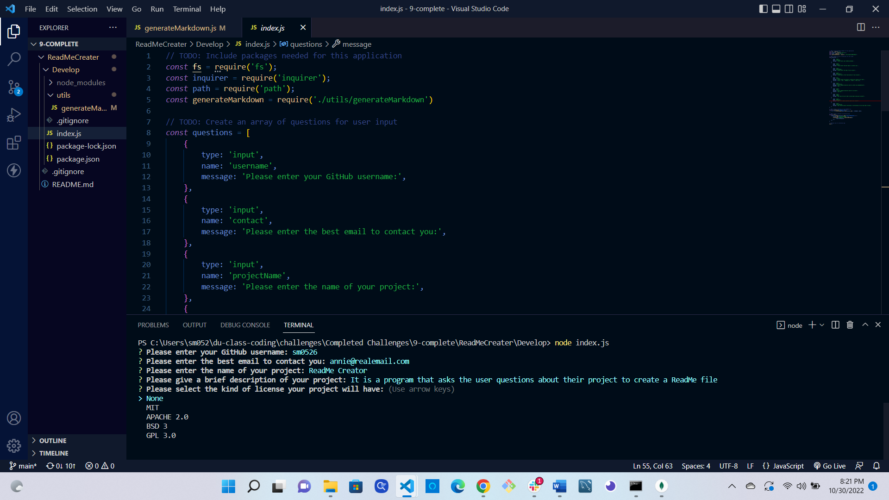

# README Creator


## Description:

When creating a project on GitHub, it’s important to have a high-quality README. The README should include what the program is for, how to use the it, how to install it, how to report issues, and how to make contributions to the project which will increase the chance that other developers will add to the success of the project.

You can easily create a README file by using a command-line application to quickly generate one. This allows the project creator to focus more time to working on the project.

## User Story:

>As a developer I want a README generator that is easy to use and will allow me to quickly create a README file for the project I am working on.

## Running the Program

```bash
node index.js
```

## Screenshots/Demos

#### Screenshot 



#### Video Walkthrough 

[Video showing how to use the program]()

## Credits

* Shanon Holland --GitHub: [sm0526](https://github.com/sm0526)

### Tools

> #### Inquirer [Inquirer package](https://www.npmjs.com/package/inquirer/v/8.2.4)
>
> - An amazing resource, this command line interface for Node.js will allow you to take user input and store it in a variable so that we can use the information in our program.
